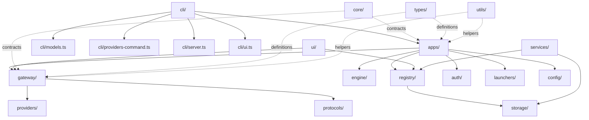

# Architecture Overview

> anygate routes any model into any coding agent — launch tools, switch providers, and run local API gateways.

## System Vision

anygate is a Node.js CLI and web dashboard that connects AI coding tools to **any** LLM provider behind a unified Anthropic-compatible or OpenAI-compatible API surface, and runs local API gateways on your machine.

**Design philosophy: App-first, not model-first.** The user picks a *tool* (Claude Code, Codex, Gemini CLI, Antigravity) and a *provider*, then anygate handles all protocol translation, proxy management, and environment isolation transparently. The user never manually configures base URLs or API keys in child tools.

## Supported Targets

| Target | Command | Protocol |
|--------|---------|----------|
| Claude Code CLI | `anygate claude` | Anthropic `/v1/messages` |
| Claude Desktop (Cowork) | `anygate claude-app` | Anthropic `/v1/messages` |
| OpenAI Codex CLI | `anygate codex` | OpenAI Responses API |
| ChatGPT Desktop (Codex) | `anygate codex-app` / `chatgpt` | OpenAI Responses API |
| Google Gemini CLI | `anygate gemini` | Google Gemini native |
| Antigravity CLI/App/IDE | `anygate antigravity` / `agy` | Cloud Code (Gemini-style) |
| API Server | `anygate server` | Anthropic + OpenAI dual |
| Web Dashboard | `anygate ui` | REST API + Svelte 5 SPA |

## Technology Stack

| Layer | Technology |
|-------|-----------|
| Runtime | Node.js 18+ |
| Language | TypeScript (strict, ESM) |
| Build | tsup → ESM CLI bundle, Vite → Svelte 5 SPA |
| CLI UI | @clack/prompts, picocolors |
| AI SDK | Vercel AI SDK (`ai` + `@ai-sdk/*`) |
| Credential Storage | @napi-rs/keyring (optional) |
| Web Frontend | Svelte 5 + Vite |
| Testing | Vitest |

## Domain Architecture

anygate's `src/` directory is organized into 17 focused, single-responsibility domains:



### Domain Purposes

| Domain | Path | Purpose |
|--------|------|---------|
| **Apps** | `src/apps/` | Per-tool launch logic (Claude, Codex, Gemini, Antigravity) + shared utilities |
| **Auth** | `src/auth/` | OAuth device flows, PKCE, keyring adapters, token refresh |
| **CLI** | `src/cli/` | Subcommand handlers dispatched from `src/cli.ts` |
| **Config** | `src/config/` | Constants, paths, environment variable resolution |
| **Gateway** | `src/gateway/` | HTTP proxies, SDK adapters, API server, Cloud Code gateway |
| **Providers** | `src/providers/` | OpenCode serve discovery only (per-vendor stubs removed) |
| **Registry** | `src/registry/` | Provider/model catalog, templates, sync, storage, validation |
| **Services** | `src/services/` | Cross-cutting: doctor, self-update, health, analytics |
| **Shared** | `src/shared/` | HTTP utilities, error helpers, redaction |
| **Storage** | `src/storage/` | Local preferences, credentials, favorites, history, analytics |
| **Types** | `src/types/` | TypeScript type definitions |
| **UI** | `src/ui/` | Web dashboard backend (REST API) + Svelte 5 frontend |
| **Utils** | `src/utils/` | Pure helper functions (crypto, files, JSON, network, paths) |

## Build Pipeline

```text
src/cli.ts ──tsup──→ dist/cli.js (ESM, node18 target, shebang injected)
                      ├── dist/chunk-*.js (code-split chunks)
                      └── dist/*.js.map (source maps)

src/ui/app/ ──vite──→ src/ui/app/dist/ (Svelte 5 SPA)
                      └── scripts/copy-ui-assets.mjs → dist/ui/dist/
```

## Key Architectural Decisions

1. **Local proxy, not config patching**: anygate never modifies `~/.claude/settings.json` or any tool's config files. Instead, it starts a local HTTP proxy and passes `ANTHROPIC_BASE_URL` / `ANTHROPIC_API_KEY` as environment variables to the child process.

2. **Vercel AI SDK for translation**: Non-Anthropic providers route through the Vercel AI SDK (`@ai-sdk/*`). The SDK handles wire format quirks, endpoint selection, and provider-specific features. anygate's `sdk-adapter.ts` translates Anthropic `/v1/messages` requests into SDK calls and streams Anthropic-format SSE responses back.

3. **Environment isolation**: 17 conflicting environment variables are stripped from child processes to prevent Vertex AI, Bedrock, AWS, and stale Anthropic config from leaking through. The parent shell is never modified.

4. **OS credential store first**: API keys go in the OS keyring (macOS Keychain, Windows Credential Manager, Linux Secret Service) via `@napi-rs/keyring`. If the native module is unavailable, anygate falls back to shell profile export lines.

5. **Catalog routing for favorites**: When the user has favorite models, anygate starts a multi-route proxy that exposes each favorite as a separate "model" via Claude Code's `/model` switch menu. Each model alias maps to a different backend provider+model combination.

---

**See also:**
- [Request Lifecycle](request-lifecycle.md) — full traced request flow
- [Routing Engine](routing-engine.md) — routing and selection logic
- [Gateway](gateway.md) — proxy, adapter, and server architecture
- [Provider System](provider-system.md) — templates, registry, credentials
