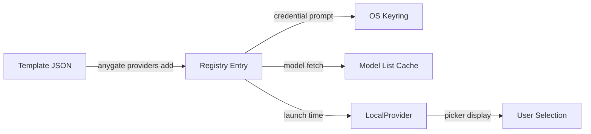

# Provider System

> How providers are defined, added, credentialed, and resolved into launchable model catalogs.

## Provider Lifecycle



### 1. Template Definition

Provider templates are JSON files in `src/registry/data/templates/` (19 files). Each defines:

```typescript
interface ProviderTemplate {
  id: string;              // e.g., "groq"
  name: string;            // e.g., "Groq"
  authType: 'api' | 'oauth' | 'none';
  npm: string;             // Vercel AI SDK package, e.g., "@ai-sdk/groq"
  defaultBaseUrl?: string; // API endpoint
  modelsPath?: string;     // "/openai/models" or "/v1/models"
  modelSource: 'api-list' | 'static-seed' | 'manual-only' | 'zen-go-api';
  supported: boolean;
  // ... signup URL, headers, static models, etc.
}
```

Templates are loaded at build time from JSON with an in-memory fallback array.

### 2. Adding a Provider

`anygate providers add` triggers `runTemplateAddFlow(template)`:

1. Pick a template from the catalog (19+ options)
2. Prompt for API key (or run OAuth device flow)
3. Validate the key against the provider's API
4. Fetch initial model list
5. Save to `~/.anygate/providers.json` via `addProviderFromTemplate()`
6. Save credential to OS keyring via `saveProviderCredential()`

### 3. Registry Storage

Configured providers live in `~/.anygate/providers.json`:

```json
{
  "providers": [
    {
      "id": "groq",
      "name": "Groq",
      "authType": "api",
      "npm": "@ai-sdk/groq",
      "baseUrl": "https://api.groq.com/openai/v1",
      "models": [
        { "id": "llama-3.3-70b-versatile", "name": "Llama 3.3 70B" }
      ]
    }
  ]
}
```

CRUD operations: `src/registry/storage/crud.ts` and `src/registry/storage/io.ts`.

### 4. Runtime Resolution

At launch, `fetchProviderCatalog()` merges:

1. **OpenCode Zen/Go** — cloud backends (when API key is present)
2. **Registry providers** — from `~/.anygate/providers.json`
3. **OpenCode-imported providers** — same registry, imported via `providers import`

Each becomes a `LocalProvider`:

```typescript
interface LocalProvider {
  id: string;
  name: string;
  authType: 'api' | 'oauth' | 'none';
  models: LocalProviderModel[];
  source: 'zen' | 'go' | 'registry' | 'opencode';
}

interface LocalProviderModel {
  id: string;
  name: string;
  modelFormat: ModelFormat;
  npm?: string;
  contextWindow?: number;
  upstreamModelId?: string;
  // ... pricing, reasoning, input types
}
```

## Provider Categories

### OpenCode Cloud (Zen / Go)

Two built-in backends that require an OpenCode API key:

| Backend | URL | Tier |
|---------|-----|------|
| Zen | `https://opencode.ai/zen` | Free tier (rate-limited) |
| Go | `https://opencode.ai/zen/go` | Paid tier |

Models are fetched from the OpenCode registry API. Zen models can be filtered to free-only via `subscriptionFilter`.

### SDK-Backed Providers (19+ Templates)

Providers routed through the Vercel AI SDK. Supported:

Agent Router, Anthropic, Cerebras, Cohere, DeepInfra, DeepSeek, Fireworks, Groq, Kilo, LM Studio, Mistral, NVIDIA, Ollama, OpenCode Cloud, OpenRouter, OVH, Perplexity, Scaleway, Together AI, Venice, xAI

### OAuth Providers

Three providers use OAuth device code flows:

| Provider | Flow | Module |
|----------|------|--------|
| GitHub Copilot | GitHub device code | `src/auth/github.ts` |
| OpenAI | OpenAI device code | `src/auth/openai.ts` |
| xAI (Grok) | xAI device code | `src/auth/xai.ts` |

### Custom Endpoints

Users can add custom OpenAI-compatible or Anthropic-compatible endpoints via `anygate providers add` → "Custom endpoint".

## Credential Resolution

```text
resolveProviderCredential(providerId)
  → readFromCredentialStore(keyringKey)     // OS keyring first
  → readFromEnvironment(envVarName)         // fallback: env var
  → null                                   // no credential found
```

Credentials are stored with service name `anygate` and account name matching the provider ID. The `@napi-rs/keyring` package provides cross-platform access:

| Platform | Store |
|----------|-------|
| macOS | Keychain |
| Windows | Credential Manager |
| Linux | Secret Service (GNOME Keyring / KWallet) |

If the native module is unavailable, anygate falls back to shell profile export lines (`~/.zshrc`, `~/.bashrc`).

## Model Catalog Operations

### Fetching Models

`refreshProviderModels(providerId)` calls the provider's model listing API:
- Most providers: `GET /v1/models` or `/openai/models`
- Static-seed providers: use pre-defined model lists
- Zen/Go: fetch from OpenCode registry API

### Model Sync

Background sync (`src/registry/sync/`) periodically refreshes model lists and credential validity.

### Model Search

For large catalogs (>25 models), the picker uses fuzzy search via `selectModelWithSearch()`.

---

**See also:**
- [Authentication](authentication.md) — OAuth flows and token management
- [Gateway](gateway.md) — how providers are used at request time
- [Reference: Supported Providers](../reference/supported-providers.md) — full provider table
