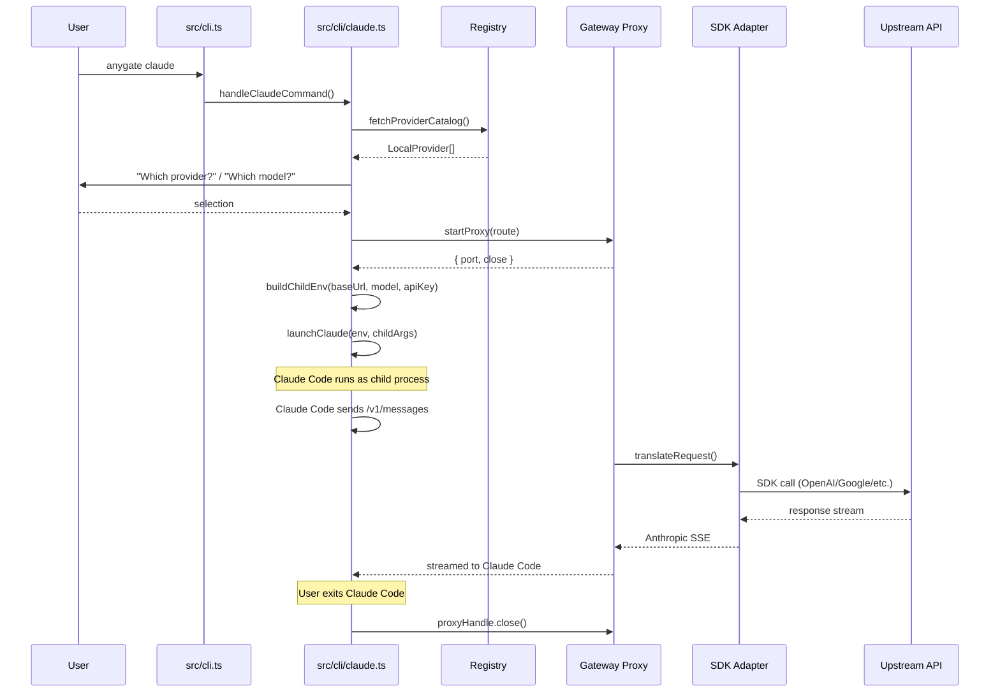

# Request Lifecycle

> Traces the full journey of a request from CLI invocation to upstream API call and back.

## High-Level Flow



## Path 1: Direct Anthropic (No Proxy)

When the selected model speaks native Anthropic format (e.g., Claude on OpenCode Zen/Go):

```text
CLI parse → resolveOrCollectApiKey() → selectModelWithSearch()
  → buildChildEnv(backends.zen.baseUrl, model, apiKey)
  → launchClaude(env)          // ANTHROPIC_BASE_URL points directly at OpenCode
  → Claude Code talks to OpenCode Zen/Go natively
  → proxyHandle not needed — no local proxy
```

Key: `ANTHROPIC_BASE_URL` is set to the backend URL directly. No proxy starts. `CLAUDE_CODE_DISABLE_EXPERIMENTAL_BETAS=1` is set to avoid beta tool issues on third-party servers.

## Path 2: SDK Proxy (Non-Anthropic Provider)

When the selected model requires protocol translation (e.g., Groq, Mistral, OpenAI):

```text
CLI parse → resolveOrCollectApiKey() → selectModelWithSearch()
  → startProxy({
      providerId, modelId, apiKey, baseURL, npm,
      contextWindow, upstreamModelId
    })
  → Proxy binds to random local port (e.g., 127.0.0.1:54321)
  → buildChildEnv("http://127.0.0.1:54321", model, apiKey)
  → launchClaude(env)

  Claude Code sends POST /v1/messages to proxy
    → sdkTranslateRequest(body)        // Anthropic → SDK format
    → createLanguageModel(npm, model)  // dynamic SDK provider import
    → streamText(model, messages)      // Vercel AI SDK call
    → streamAnthropicResponse(stream)  // SDK → Anthropic SSE
    → response streamed back to Claude Code
```

The proxy labels these models `(via proxy)` in the picker.

## Path 3: Favorites Catalog (Multi-Route Proxy)

When the user has saved favorite models:

```text
CLI parse → buildCatalogRoutes(startingModel, favorites)
  → Each favorite → { aliasId, providerId, modelId, npm, apiKey, ... }
  → Max 20 routes (MAX_MODEL_CATALOG)
  → startProxyCatalog(routes)
  → Proxy exposes each route as a separate "model"
  → Claude Code /model switch menu shows all favorites
  → Route resolver matches incoming model ID to the right backend
```

The alias ID format is `providerId__modelId` (double underscore). Claude Code's model list endpoint returns all aliases, enabling mid-session model switching.

## Path 4: API Server (Gateway Mode)

```text
CLI parse → runServerCommand()
  → Server wizard: pick providers, listen mode, password
  → createGatewayModelCatalog(providers)
  → startServer(port=17645, routes, auth)
  → Exposes:
      /anthropic/v1/messages   → Anthropic format
      /openai/v1/chat/completions → OpenAI format
      /v1/messages             → Anthropic shorthand
  → Any Anthropic/OpenAI client can connect
```

The server supports vendor-mask mode for Claude Desktop/Cowork, which rewrites discovery IDs so Claude Desktop sees anygate models in its native model picker.

## Path 5: Antigravity (Cloud Code Gateway)

```text
CLI parse → handleAntigravityCommand()
  → startCloudCodeGateway(providers, routes)
  → Gateway mimics Google Cloud Code API
  → Antigravity connects to local gateway
  → Request flow:
      Antigravity → Cloud Code format
      → anthropicToCloudCode() or direct SDK
      → Upstream API
      → cloudCodeToAnthropic() or direct
      → Back to Antigravity
```

## Path 6: Web Dashboard (`anygate ui`)

```text
CLI parse → handleUiCommand()
  → Start HTTP server (default port 24678)
  → Serve Svelte 5 SPA from dist/ui/dist/
  → REST API handles:
      GET /api/providers, /api/models, /api/apps
      POST /api/apps/launch → spawns `anygate claude --provider X --model Y`
      POST /api/server/start → starts gateway in-process
      POST /api/providers/add → template-based provider setup
      POST /api/oauth/* → device code flows in browser
```

## Environment Isolation

Every launch path runs through `buildChildEnv()` which:

1. Copies `process.env`
2. **Deletes** 17 conflicting env vars (Vertex AI, Bedrock, AWS, Foundry, stale Anthropic)
3. **Sets** `ANTHROPIC_BASE_URL`, `ANTHROPIC_API_KEY`, `ANTHROPIC_MODEL`
4. **Sets** `ANTHROPIC_SMALL_FAST_MODEL` (context-window-annotated variant)
5. **Optionally sets** `CLAUDE_CODE_MAX_CONTEXT_WINDOW` for the model's actual window size
6. **Optionally sets** `CLAUDE_CODE_DISABLE_EXPERIMENTAL_BETAS=1` for direct (non-proxy) routes

When the child process exits, the parent shell is completely unchanged — no cleanup needed.

---

**See also:**
- [Gateway](gateway.md) — proxy and SDK adapter internals
- [Routing Engine](routing-engine.md) — how routes are resolved
- [Launcher System](launcher-system.md) — how child processes are spawned
